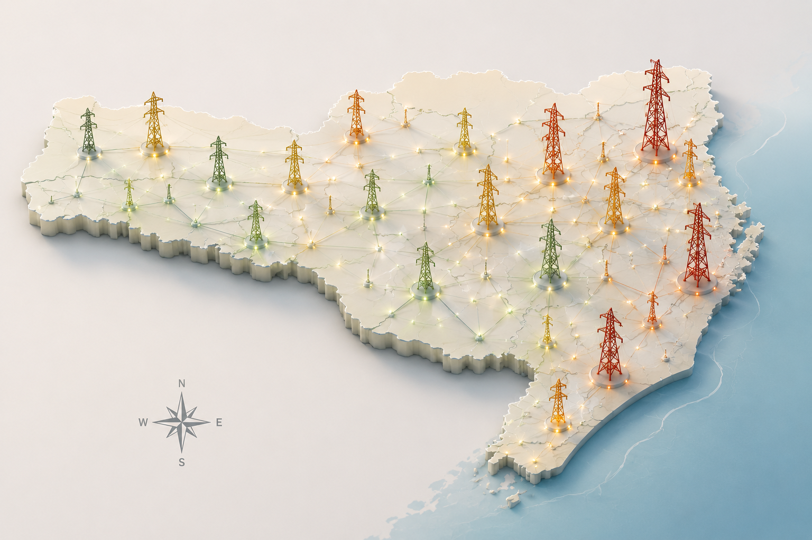

# Energy Market of Santa Catarina

<p align="center">
  
</p>

---

An exploratory Data Analytics project investigating the electricity market of Santa Catarina (Brazil) through public energy consumption data from **1994 to 2026**.

The project combines exploratory data analysis, territorial analysis and technical documentation to understand how electricity demand reflects regional economic dynamics and energy infrastructure.

> **This repository documents not only the analytical results, but also the evolution of the analytical process, architectural decisions and code review developed throughout the project.**

---

# Project Overview

The project is organized as a sequence of research questions.

Each notebook investigates one analytical question and serves as the foundation for the next stage of the research.

---

# Research Questions

### Phase 1 — Exploratory Analysis

- How is electricity consumption distributed among Santa Catarina municipalities?

- How has electricity consumption evolved between 1994 and 2026?

- How is energy consumption distributed across the IBGE Intermediate Geographic Regions?

- How are Consumer Units (UC) distributed throughout the state?

---

# Future Research Questions

The next analytical stages will expand the project by integrating additional datasets.

Planned topics include:

- Digital infrastructure
- Data Centers
- Artificial Intelligence infrastructure
- Fiber optic backbone
- Submarine cable landing points
- Regional economic indicators
- Territorial competitiveness

---

# Repository Navigation

## Exploratory Notebooks

| Notebook | Description |
|----------|-------------|
| [Notebook 01 – Initial Exploration](notebooks/01_exploracao.ipynb) | Initial exploratory analysis of the dataset. |
| [Notebook 02 – Temporal Evolution](notebooks/02_evolucao_temporal_consumo.ipynb) | Time-series analysis of electricity consumption (1994–2026). |
| [Notebook 03 – Regional Distribution](notebooks/03_distribuicao_regional_consumo.ipynb) | Electricity consumption aggregated by IBGE Intermediate Geographic Regions. |
| [Notebook 04 – Consumer Units Distribution](notebooks/04_distribuicao_das_UC.ipynb) | Spatial distribution of Consumer Units (UC). |

---

## Code Review

These documents summarize the analytical evolution of each notebook.

| Document | Description |
|----------|-------------|
| [NB01](docs/arquitetura/code_review_fase_1/NB01.md) | Review of Notebook 01. |
| [NB02](docs/arquitetura/code_review_fase_1/NB02.md) | Review of Notebook 02. |
| [NB03](docs/arquitetura/code_review_fase_1/NB03.md) | Review of Notebook 03. |
| [NB04](docs/arquitetura/code_review_fase_1/NB04.md) | Review of Notebook 04. |
| [Function Candidates](docs/arquitetura/code_review_fase_1/funcoes_possibilidade.md) | Candidate functions identified during the exploratory phase. |

---

## Technical Reports

| Document | Description |
|----------|-------------|
| [Exploratory Report](docs/relatorios/Santa_Catarina_Energy_Relatorio_fase_exploratoria.pdf) | Technical report describing the analytical findings of Phase 1. |
| [Santa Catarina Energy Atlas](docs/relatorios/Santa_Catarina_Energy_Atlas_fase_exploratoria.pdf) | Atlas containing maps, figures and visual summaries produced during the project. |

---

## Methodology

| Document | Description |
|----------|-------------|
| [Analytical Guide](docs/guia_analise.md) | Analytical workflow adopted throughout the project. |
| [Methodological Decisions](docs/decisoes_metodologicas.md) | Record of methodological decisions taken during the research. |
| [Project Roadmap](docs/roadmap_projeto.md) | Research evolution and future analytical directions. |

---

# Repository Structure

```text
03_Mercado_Energia_SC/

├── data/                           # Raw and processed datasets
├── notebooks/                      # Exploratory notebooks
├── src/                            # Future reusable Python modules
├── images/                         # Figures, maps and project cover
│
├── docs/
│   ├── arquitetura/
│   │   └── code_review_fase_1/
│   ├── estudos/
│   ├── relatorios/
│   ├── guia_analise.md
│   ├── decisoes_metodologicas.md
│   └── roadmap_projeto.md
│
├── README.md
└── .gitignore

---

# Connect With Me

### LinkedIn

[Maria Laura Corrêa da Silva](https://www.linkedin.com/in/maria-laura-corrêa-da-silva-059633287)

### GitHub

[mlsfinternacional-cpu](https://github.com/mlsfinternacional-cpu)

---

# Final Remarks

This repository documents both the analytical results and the analytical process behind them.

It was designed to be explored from different perspectives:

follow the notebooks to understand the analytical workflow;
read the reports for a technical summary of the findings;
inspect the code review documents to understand how the notebooks evolved;
review the methodological documents to understand the research decisions.

The project will continue to evolve as new research questions are incorporated.

